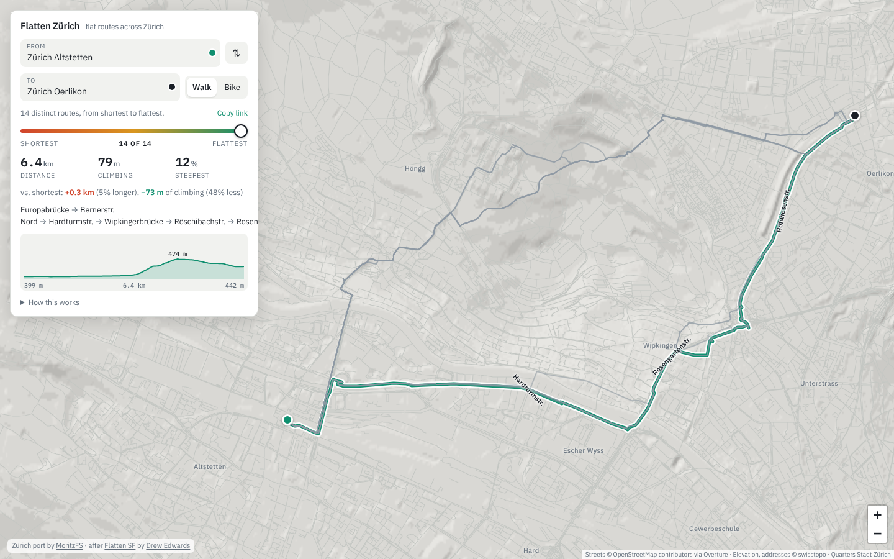
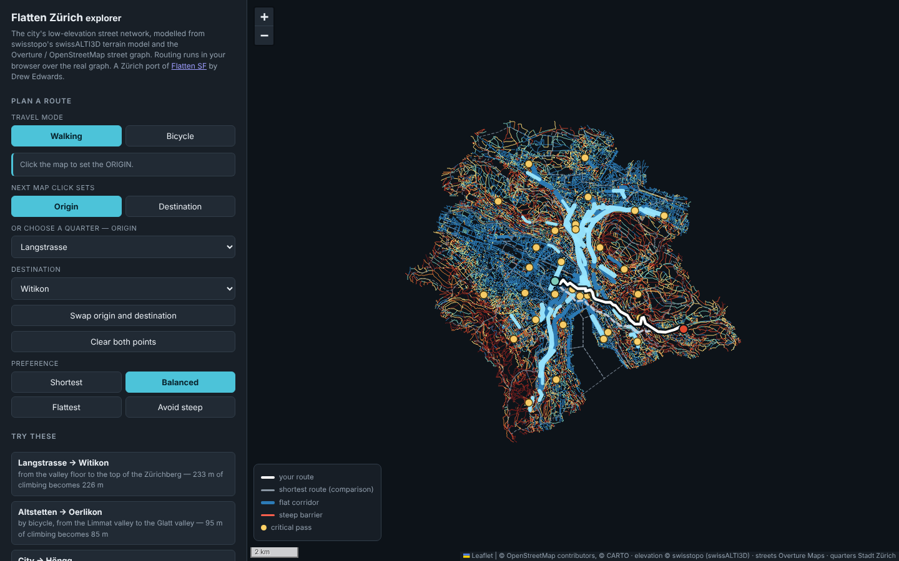
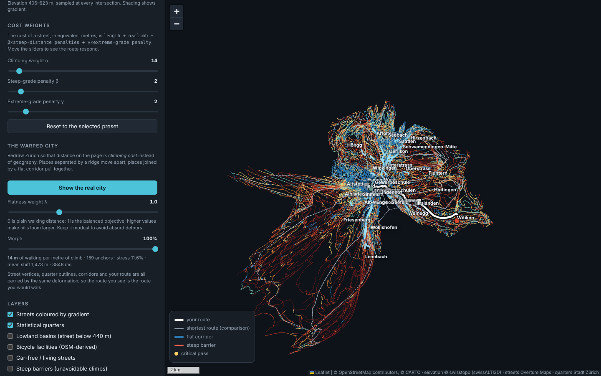
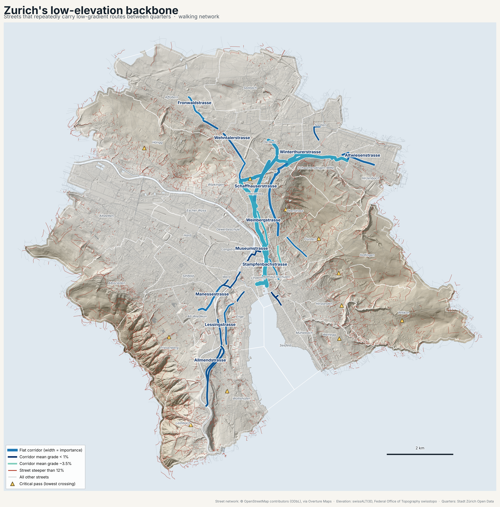

# Flatten Zürich

**[moritzfs.github.io/flatten_zrh](https://moritzfs.github.io/flatten_zrh/)**:
the flattest walking or cycling route between any two places in Zürich, and
every route between it and the shortest.

> **This is a Zürich port of [Flatten SF](https://flattensf.com/)
> ([source](https://github.com/almostimplemented/flattensf)) by
> [Drew Edwards](https://almostimplemented.com) (@almostimplemented).** The
> idea, the method, the in-browser router, the route-finder page and most of
> the code are theirs, used under the MIT licence (Copyright (c) 2026
> sf-flat-routes contributors; the notice is kept in [`LICENSE`](LICENSE)).
> The first code commit in this repository is upstream's code, unmodified
> apart from the package directory's name, so everything after it reads as a
> diff of the port. What is new here is the Zürich data, the Swiss-specific network
> rules and validation, and the write-up below.



Zürich is hilly in a particular way. The city fills two valley floors -- the
Limmat's, with the lake at 406 m, and the Glatt's, behind it at 430-440 m --
divided by a continuous ridge from the Hönggerberg over the Käferberg and
the Zürichberg to the Adlisberg, and closed in on the west by the Uetliberg.
Quarters such as Fluntern, Hottingen, Witikon, Höngg and Friesenberg sit on
those slopes. This project models the street network from swisstopo's
lidar-derived terrain model and OpenStreetMap, routes across it under several
definitions of "flat", and works out which streets the geography forces
low-gradient traffic onto.

**The central result: on foot, about 5% more walking buys about 27% less
climbing.** Averaged over all 1,122 ordered pairs of the city's 34
statistical quarters, the minimum-climbing route is only 5% longer than the
shortest one, avoids 27% of the ascent, and drops the typical steepest pitch
from 22% to 15%. That is less than San Francisco's 14% / 39%, and the
reason is the geography: much of Zürich's climbing between quarters is up to
quarters that are themselves on the slopes, and cannot be avoided, only made
gentler.

The full write-up is in **[`outputs/findings.md`](outputs/findings.md)**, and
the checks against independent references are in
**[`outputs/validation_report.md`](outputs/validation_report.md)**.

## The route finder

**Live: [moritzfs.github.io/flatten_zrh](https://moritzfs.github.io/flatten_zrh/)**

Type where you are and where you are going, then drag the slider from
**shortest** to **flattest** and watch the route change. Every position is a
real route, solved in your browser over the full street graph with the same
cost model the analysis uses (see upstream's README for how the frontier of
routes is found). It opens on Altstetten station to Oerlikon station: the
shortest walk climbs about 150 m over the shoulder of the Käferberg, the
flattest keeps to the valley and crosses the ridge at the Bucheggplatz saddle
for about half of that and 5% more distance.

Place search is offline and built into the page: street intersections
("Langstrasse & Josefstrasse", or "langstr und josefstr"), addresses in
Swiss order ("Bahnhofstrasse 12", from swisstopo's official address
register), about 900 tram and bus stops ("Bellevue", "Bucheggplatz") and
some 6,000 parks, stations, schools, landmarks, shops and cafés. Umlauts fold,
so "Zuerich", "Zurich" and "Zürich" all match, as do "Strasse" and "Straße".
You can also click the map or drag either pin, and "Copy link" gives a URL
that reopens the exact trip.

The site is static: [`site/`](site/) holds the page, its CSS and JS, the
whole street graph as one 4.7 MB gzipped file and the hillshade as a PNG,
and GitHub Pages serves it as is. The same page is also written as one
self-contained file,
[`outputs/zrh_flat_route_finder.html`](outputs/zrh_flat_route_finder.html),
which opens straight from disk.

### The explorer and the warped city

[`outputs/zrh_flat_routes_map.html`](outputs/zrh_flat_routes_map.html) is
upstream's working view of the analysis, ported: the network coloured by
gradient, the discovered corridors, passes, barriers and basins as layers,
the four objectives with live α/β/γ sliders, and the city redrawn so that
distance on the page means climbing cost.





## Headline findings

- **One pass dominates the city.** Bucheggstrasse, at 473 m, is the binding
  constraint for 114 of 561 quarter pairs: the lowest point of the ridge
  between the Limmat and Glatt valleys. The model computes it exactly with a
  minimax (bottleneck) search and was not told where it is; it lands within
  a metre of the 472 m Wikipedia gives for Bucheggplatz.
- **The spine runs over that pass.** The top two discovered corridors are
  the way from the Limmat to Oerlikon: Limmatquai, Stampfenbachstrasse and
  Schaffhauserstrasse up to the Bucheggplatz-Milchbuck saddle, Hofwiesen-,
  Buchegg- and Schaffhauserstrasse down the other side.
- **The other passes are not cols but summits of approach.** Witikon
  (623 m), Fluntern (614 m), Hottingen (582 m), Höngg and Friesenberg are
  reached only by climbing; the flat network can choose the gentlest
  approach, not avoid the height.
- **Total climbing and peak steepness are different objectives.** The
  grade-averse route climbs *more* in total than the flattest (66 m against
  58 m) while holding the steepest pitch to 8% instead of 15%.
- **The biggest savings cross the city around the Zürichberg.** Hirzenbach
  (Schwamendingen) to Leimbach: the shortest walk climbs 354 m over the
  Zürichberg; the flattest climbs 149 m for 13% more distance.

## What changed in the port

The pipeline is upstream's, stage for stage (download, build-network,
analyze, validate, map, report, sensitivity), with San Francisco's data and
assumptions replaced by Zürich's. The differences that matter:

**Elevation.** USGS 3DEP 1 m lidar becomes swisstopo's **swissALTI3D**, 2 m
tiles of the 2026 edition, in its native CH1903+/LV95 (EPSG:2056), which is
also the projected CRS for every length and slope. Upstream's chain is kept
as is: a 3 m Gaussian pre-filter, sampling every 5 m, Savitzky-Golay
smoothing over ~50 m per street segment, one elevation per intersection, a
0.5 m dead-band on cumulative gain, and linear ramps across bridges and
tunnels. Two additions: **covered** streets (under a building, an arcade)
are treated as structures too, and streets that pass **under** a road or
rail bridge are interpolated across the crossing, because the bare-earth
model fills the space under a removed deck from the embankments either side
(before this, Bullingerstrasse read 54% where it runs under a building).

**Network rules, verified against the data.**
- Zürich's OpenStreetMap maps the sidewalks of most main roads as their own
  ways and then closes the carriageway to walkers. The model, like
  upstream's, walks on centrelines and leaves sidewalks out, so read
  literally that makes Rosengartenstrasse and the Bucheggplatz roundabout --
  the lowest crossing between the valleys -- unwalkable. A centreline lined
  by a mapped sidewalk for at least half its length therefore stays open on
  foot (1,330 edges); tunnels and roads without sidewalks stay closed.
- Swiss signage law closes footpaths and pedestrian zones to bicycles unless
  a plate admits them, and Swiss mappers leave that default implicit: 41,000
  of 44,000 footway segments carry no bicycle rule. Bicycles therefore need
  an explicit permit on those two classes; upstream treats a missing rule as
  allowed.
- Lowland basins are delineated below 440 m (upstream: 15 m above the bay),
  which separates the two valley floors.

**Places.** Overture's places schema moved from `categories` to `taxonomy`;
tram and bus stops are added to the search, because that is how Zürich gives
directions; addresses come from swisstopo's official register; and Overture's
Foursquare records (Apache 2.0) are left out.

**Units and language.** Metric throughout; German-aware search; "Strasse"
shortened to "Str." in route labels as on Swiss signs.

## Validation

Full report: [`outputs/validation_report.md`](outputs/validation_report.md).

- **swissALTI3D against DHM25**, swisstopo's 25 m model interpolated from
  the National Map's contours (so sharing no lidar), at 4,000 random points
  on land in the city: mean difference −0.03 m, RMS 1.97 m, 80% within 2 m.
  swisstopo gives DHM25's own average deviation as 1.5 m on the plateau.
- **Grades against OpenStreetMap `incline` tags** (mostly copied from
  gradient signs): on 70 tagged streets and lanes, a median difference of
  0.9 percentage points and 84% within 3 points; footways and cycle paths
  similar; hiking paths, whose tags are often guesses, much worse. The Altstadt
  lanes (Stüssihofstatt 17%, Trittligasse, Kirchgasse 13%) come out right.
- **Known flat streets** -- Limmatquai, the lake promenade, Bahnhofstrasse,
  Langstrasse, Badenerstrasse, Limmatstrasse and Sihlquai, the Hardturm
  plain, Thurgauerstrasse -- all measure 0.4-3.9 m of climbing per km.
- **The saddle.** The exact lowest crossing from Central to Oerlikon is
  472.6 m on Bucheggstrasse, against 472 m published for Bucheggplatz, and
  the flat bicycle routes top out at Bucheggplatz.

## What it produces

| Output | What it is |
|---|---|
| [`site/`](site/) | The route finder as a static site, deployed to GitHub Pages by [`.github/workflows/pages.yml`](.github/workflows/pages.yml). |
| [`outputs/zrh_flat_route_finder.html`](outputs/zrh_flat_route_finder.html) | The same page as one self-contained file. |
| [`outputs/zrh_flat_routes_map.html`](outputs/zrh_flat_routes_map.html) | The explorer: every analysis layer, the four objectives, the warped city. |
| [`outputs/zrh_flat_backbone.png`](outputs/zrh_flat_backbone.png) / `.pdf` | Static map of the low-elevation backbone over a swissALTI3D hillshade. |
| [`outputs/zrh_street_grades.png`](outputs/zrh_street_grades.png) | Citywide street-gradient map. |
| [`outputs/findings.md`](outputs/findings.md) | Written analysis; every figure generated from the outputs. |
| [`outputs/validation_report.md`](outputs/validation_report.md) | Checks against DHM25, incline tags, flat streets and the saddle. |
| `outputs/flat_corridors.geojson` / `.gpkg` / `.csv` | The discovered corridors. |
| `outputs/neighborhood_pairs.csv` | 8,976 routes: every ordered quarter pair × 4 objectives × 2 modes. |
| `outputs/pareto_frontier.csv` | Distance / climbing / peak-gradient frontiers for every pair. |
| `outputs/passes.geojson` / `.csv`, `outputs/pass_matrix.csv`, `outputs/basin_passes.csv` | Critical passes and the lowest crossing for every quarter pair. |
| `outputs/barriers.geojson` / `.csv` | Steep streets that inter-quarter traffic cannot avoid. |



## Data sources

All verified 2026-10-06. `python -m zrh_flat_routes sources` prints the full
table with limitations.

| Dataset | Publisher | Licence | Role |
|---|---|---|---|
| Overture Maps transportation, release `2026-09-23.1` | Overture Maps Foundation, from OpenStreetMap (and a little TomTom) | ODbL 1.0 | Street network, classes, access, bridges and tunnels |
| swissALTI3D, 2 m, 2026 edition | Federal Office of Topography swisstopo | swisstopo OGD; source reference required | Elevation |
| DHM25 matrix model (25 m) | Federal Office of Topography swisstopo | swisstopo OGD; source reference required | Independent elevation cross-check |
| Statistische Quartiere | Stadt Zürich (Statistik Stadt Zürich, GIS-Zentrum), Open Data Zürich | CC0 1.0 | The 34 quarters; the city boundary |
| Official directory of building addresses | Federal Office of Topography swisstopo | swisstopo OGD; source reference required | Address search |
| Overture Maps places and base theme | Overture Maps Foundation (Meta, Microsoft, AllThePlaces...; OpenStreetMap) | CDLA Permissive 2.0 / CC0 1.0; ODbL 1.0 | Place and stop search, the lake on the maps |
| OpenStreetMap `incline` tags (Overpass API) | OpenStreetMap contributors | ODbL 1.0 | Grade validation |

**Fetching the Swiss data.** swisstopo's and the City of Zürich's hosts are
not reachable from every build environment (the one this was built in
blocked them). [`.github/workflows/mirror-data.yml`](.github/workflows/mirror-data.yml)
fetches those files from the publishers in GitHub Actions and attaches them,
unmodified except for cutting the national DHM25 and address files down to
the study area, to this repository's
[`source-data` release](https://github.com/MoritzFS/flatten_zrh/releases/tag/source-data),
with a provenance archive of URLs, dates, checksums and the publishers'
licence pages as fetched. `download` tries the publishers first and falls
back to that release.

## Reproducing it

Python 3.10+.

```bash
git clone https://github.com/MoritzFS/flatten_zrh && cd flatten_zrh
python -m venv .venv && source .venv/bin/activate
pip install -e ".[dev]"
python -m zrh_flat_routes all            # download, build, analyze, validate, map, report
python scripts/screenshots.py            # screenshots and site/preview.jpg (Playwright)
python -m pytest tests -q                # 150 tests; browser tests need Chromium
```

Each stage caches its output; `--force` recomputes one. A full run takes
under ten minutes on four cores, plus `python -m zrh_flat_routes sensitivity`
for the robustness grid. Ad-hoc routing between quarters:

```bash
python -m zrh_flat_routes route --from Langstrasse --to Witikon
```

The site is committed already built, because building it needs the cached
data. Publishing: Settings → Pages → Source: **GitHub Actions**; the workflow
deploys `site/` whenever it changes on `main`.

## Limitations

Upstream's limitations apply (elevation is the ground, travel is on
centrelines, one access point per quarter, no traffic or safety model, the
web pages quantise the graph). Zürich adds:

- **Unflagged bridges.** Streets under a bridge that OpenStreetMap does not
  tag as one keep the bare-earth model's hump: Birchstrasse in Seebach
  passes under a motorway link and still reads about 10 m too high.
- **No funiculars or lifts.** The Polybahn, the Rigiblick and Dolder
  funiculars and public lifts are not in the walking network, though for
  many people they are the flat route.
- **Statistical quarters are uneven units.** Höngg, Affoltern, Leimbach and
  Witikon are large and strung out along slopes, so one access point serves
  them less well than it serves Langstrasse or Lindenhof.

## Licence and attribution

Code: MIT, both this port's notice and upstream's -- see [`LICENSE`](LICENSE),
which also carries the note on data. In short: street geometry is
**© OpenStreetMap contributors, ODbL 1.0** (via Overture Maps), and derived
street geometry here -- the corridors, pair tables, the maps and the site's
graph -- carries ODbL share-alike obligations. Elevation and addresses:
**Federal Office of Topography swisstopo** (swissALTI3D, DHM25, official
directory of building addresses). Quarters: **Stadt Zürich**, CC0. Leaflet
1.9.4 is bundled under BSD-2-Clause
([`zrh_flat_routes/vendor/`](zrh_flat_routes/vendor/)).

Original project: **Flatten SF** by Drew Edwards,
[flattensf.com](https://flattensf.com/) ·
[github.com/almostimplemented/flattensf](https://github.com/almostimplemented/flattensf).
